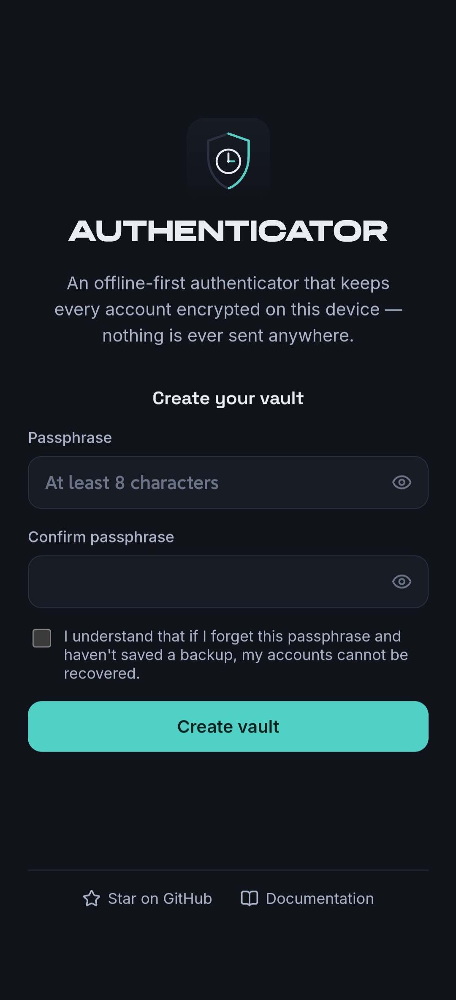
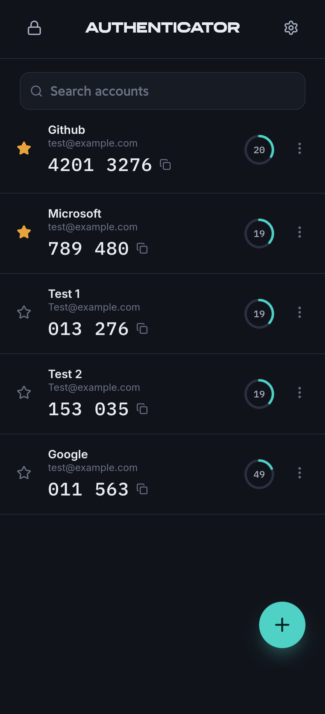

<div align="center">


# sAuth

**An offline-first, self-hosted TOTP (2FA) authenticator.**
Every account is encrypted on your device — nothing ever touches a server.

[](./LICENSE)
[](https://github.com/subashbuilds/sAuth/stargazers)
[](./CONTRIBUTING.md)
[](https://www.typescriptlang.org/)
[](https://react.dev/)
[](https://web.dev/progressive-web-apps/)

[Documentation](./DOCUMENTATION.md) · [Security](./SECURITY.md) · [Report an issue](https://github.com/subashbuilds/sAuth/issues) · [Demo](https://sauth.indevs.in)

**If this is useful, a ⭐ star helps others find it.**

</div>

---

## Why this exists

Most authenticator apps ask you to trust a company with your 2FA secrets — sync them to
"the cloud," bundle them into a broader password-manager subscription, or run closed-source
code you can't inspect. This is the alternative: a small, auditable, self-hosted web app that
does exactly one thing — generate TOTP codes — with every secret encrypted client-side under a
key that never leaves your device, and no network dependency at all once it's loaded.

## Features

- 📷 **Add accounts four ways** — scan a QR code with your camera, upload a screenshot of one
  (handy if you're setting this up from the same device the QR is displayed on), paste an
  `otpauth://` link, or type the secret in manually.
- 🔒 **Encrypted at rest** — AES-256-GCM, key derived via PBKDF2 (600k iterations), architecture
  detailed in [SECURITY.md](./SECURITY.md).
- 🔑 **Optional biometric/device unlock** via WebAuthn's PRF extension — genuinely adds
  encryption, not just a UI gate (see [Security](./SECURITY.md#webauthn-unlock-prf-only-by-design)).
- 💾 **Encrypted, portable backups** — password-protected export/import, independent of your
  vault passphrase.
- 📱 **Installable PWA** — works fully offline once loaded; add it to your home screen like a
  native app.
- 🎨 Auto-lock, dark/light/system theme, QR export for moving an account to another app.

## Screenshots

| Welcome | Vault |
|---|---|
|  |  |

## Getting started

```bash
git clone https://github.com/subashbuilds/sAuth.git
cd Authenticator
npm install
npm run dev
```

| Command | Purpose |
|---|---|
| `npm run dev` | Local development server |
| `npm test` | Run the test suite |
| `npm run build` | Type-check + production build → `dist/` |
| `npm run preview` | Serve the production build locally |
| `npm run lint` | Lint the codebase |

Requires a browser with the Web Crypto API, IndexedDB, and (for QR scanning) camera access.

## Deploying

`npm run build` produces a static `dist/` folder — deploy it to any static host (Cloudflare
Pages, Netlify, Vercel, GitHub Pages, or your own server). No backend, database, or environment
variables are required.

## Tech stack

React 19 · TypeScript (strict) · Vite · Web Crypto API · IndexedDB (via `idb`) · `vite-plugin-pwa`
· `jsqr` for QR decoding · Vitest for testing.

## Documentation

Full usage guide, the complete security model, backup/restore instructions, and FAQ live in
**[DOCUMENTATION.md](./DOCUMENTATION.md)** — the same content is also available inside the app
itself (tap **Documentation** on the welcome screen or in Settings).

## Contributing

Issues and pull requests are welcome — see [CONTRIBUTING.md](./CONTRIBUTING.md).

## License

[MIT](./LICENSE)
